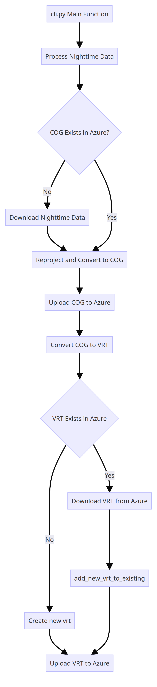

# UNDP STAC pipeline
This project processes geospatial data from remote sources into UNDP STAC GOC repo
# 1. VIIRS DNB nightly mosaics
The following image shows the steps to process the data:

## Data
The data is available at the following link:
https://eogdata.mines.edu/nighttime_light/

### Prerequisites

To use this API, you'll need to have:

- GDAL binary installed on your system
- An Azure account with access to UNDP Azure Blob storage container
- Docker installed on your local machine
- rights to spin Azure Container Instances and **az** command line in case you wish to deploy the pipeline

### Configuration

The pipeline stores it output in Azure Blob so env vars are used to configure it.
Additionally, the last two env vars are required when deploying to Azure Container instances 


- `AZURE_STORAGE_CONNECTION_STRING`
- `AZURE_REGISTRY_USERNAME`
- `AZURE_REGISTRY_PASSWORD`

```commandline
cp .env_example .env 
```
Set up correct values for the env var

### Installation

#### 1. using docker-compose

This is the easiest and preferred way

```commandline
   docker-compose run pipeline python3 -m undpstac_pipeline.cli --help
   docker-compose run pipeline python3 -m undpstac_pipeline.cli daily --help
   # run the pipeline for a given day
   docker-compose run pipeline python3 -m undpstac_pipeline.cli daily -y 2024 -m 2 -d 20  -f
   # fetch a message (yyyyMMdd string text) from service bus queue to process a day
   docker-compose run pipeline python3 -m undpstac_pipeline.cli queue -h
```


#### 2. using pipenv

1. Clone this repository to your local machine
2. Navigate to the project directory in your terminal or command prompt.
3. create a virtual env using pipenv 
4. install GDAL manually
5. install all other deps

```bash
        git clone https://github.com/UNDP-Data/geo-undpstac-pipeline.git
        cd ge-undpstac-pipeline
        pipenv --python 3 # this will create a virt env using default python interpreter
        pipenv run pip  install GDAL=`gdalinfo --version | cut -c 6-10`
        pipenv run pip install -r requirements.txt
        pipenv run python -m undpstac_pipeline.cli --help
```

### Deployment to ACI

The pipeline can be deployed to ACI using [az](https://learn.microsoft.com/en-us/cli/azure/) tool
For this the [deploy](deploy) folder contains a bash script and a template file that can be used for this purpose

> you need to have az command line setup/configured to be able to deploy!


```yaml
apiVersion: "2023-05-01"
location: westcentralus
properties:
  osType: Linux
  restartPolicy: OnFailure
  containers:
    - name: nighttimelights-test
      properties:
        environmentVariables:
          - name: AZURE_STORAGE_CONNECTION_STRING
            value: $AZURE_STORAGE_CONNECTION_STRING
        image: undpgeohub.azurecr.io/undp-data/geo-undpstac-pipeline:main
        command: ["python", "-m", "undpstac_pipeline.cli", "archive", "-s=2023-09-09", "-e=2023-09-15", "-f"]
        #command: ["python", "-m", "undpstac_pipeline.cli", "daily", "-y 2024", "-m 1", "-d 24", "-f"]
        #command: ["python", "-m", "undpstac_pipeline.cli", "daily", "-y 2024", "-m 1", "-d 24", "--lonmin=0", "--latmin=-10", "--lonmax=10", "--latmin=10", "-f"]
        resources:
          requests:
            cpu: 4
            memoryInGB: 16
  imageRegistryCredentials:
    - server: undpgeohub.azurecr.io
      username: $AZURE_REGISTRY_USERNAME
      password: $AZURE_REGISTRY_PASSWORD
tags: {}
type: Microsoft.ContainerInstance/containerGroups

```


```commandline
    cd deploy
    sh deploy_acr.sh
    
```

## Registering message into the queue

```commandline
docker-compose run pipeline python3 -m queue_register.cli -h                    
usage: cli.py [-h] {daily,archive,yesterday} ...

Register queue message to service bus queue

positional arguments:
  {daily,archive,yesterday}
                        main modes of operation
    daily               Register a day of message into the queue
    archive             Register a range of days into the queue
    yesterday           Register yesterday of message into the queue

options:
  -h, --help            show this help message and exit
```

- register a day

```commandline
python -m queue_register.cli daily -t=nighttime -d=2024-01-25
```

- register a range of days

```commandline
python -m queue_register.cli archive -t=nighttime -s=2023-01-01 -e=2023-03-31
```

- register yesterday

```commandline
python -m queue_register.cli yesterday -t=nighttime
```